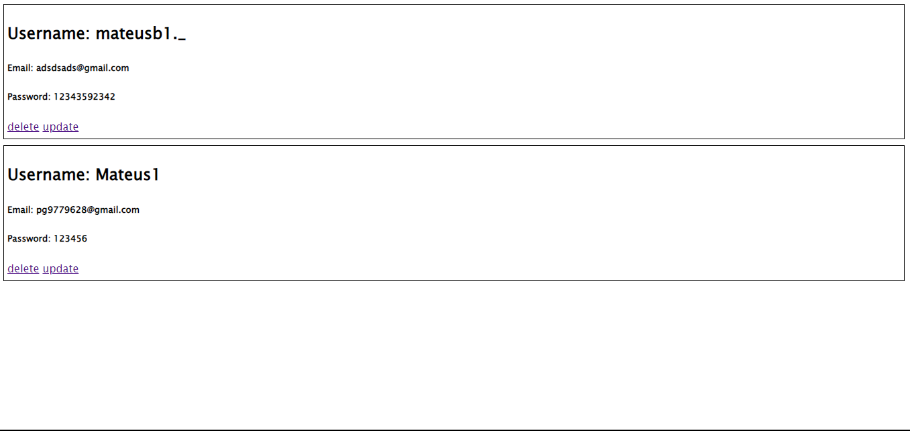

<h2>CRUD - nodejs</h2>

<h3>Um CRUD com nodejs - (express,prisma,mysql,ejs,body-parser)</h3>

Esse projeto é um site simples onde conseguimos criar/ler/atualizar/deletar usuarios de forma simples e eficiente.

<h4>/create</h4>

<h4>/read</h4>

<h4>/update</h4>

Ao clicar em update vamos para uma pagina igual ao /create porem os inputs ja estão preenchidos.

<h4>/delete</h4>

Ao clicar em delete é deletado o usuario logo apos somos redirecionados ao /read.

